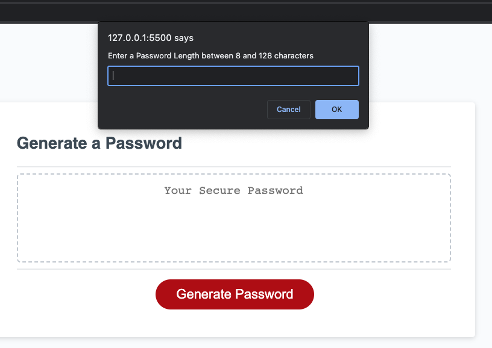
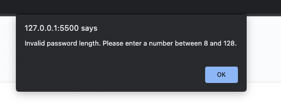
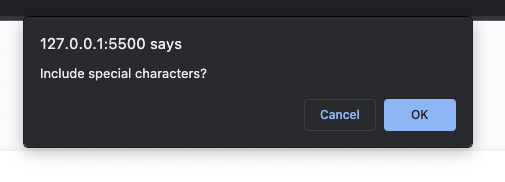
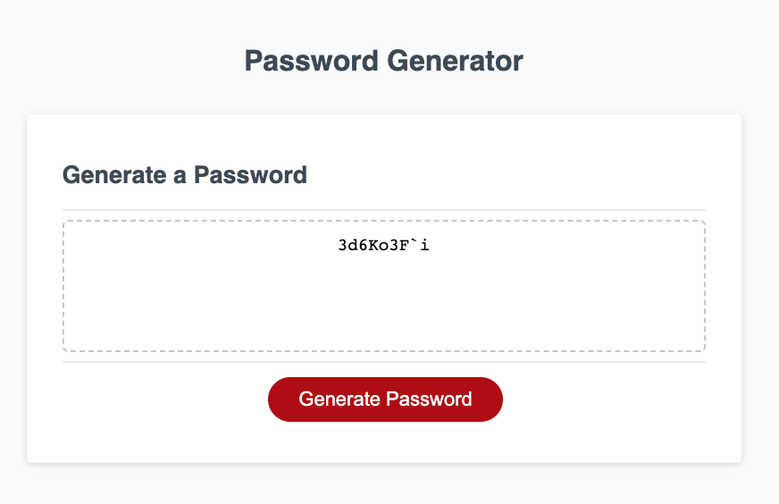

## HcaffeyModule3_javascript-challenge

# Function:
This webpage will allow a user to generate a random password based on their character selections

The user should click the start button to begin and enter a desired length between 8 and 128 characters:

If the user chooses a value outside of that range, they will receive an error:

The user will then be presented with further questions about their password:

Finally, a password according to their specifications will be generated:

